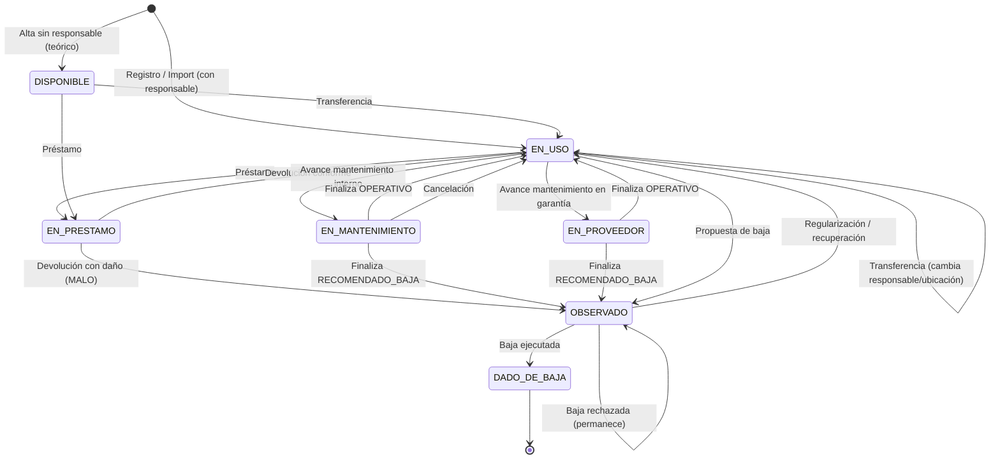

# Sistema de Control Operativo de Activos TI (UNDC) — Funcionalidades y Flujos

> Documento funcional de referencia. Describe **qué hace el sistema** y **cómo fluye
> la operatividad del activo** de punta a punta, a partir del código actual
> (controladores, modelos, rutas y middleware). Sirve como guía para el equipo y
> como base de documentación institucional.
>
> Última actualización del documento: 2026-08-08.

---

## Índice

1. [Visión general](#1-visión-general)
2. [Roles y control de acceso](#2-roles-y-control-de-acceso)
3. [Los dos ejes del activo: situación, condición y estado operativo](#3-los-dos-ejes-del-activo)
4. [Ciclo de vida del activo (diagrama)](#4-ciclo-de-vida-del-activo)
5. [Módulo: Activos](#5-módulo-activos)
6. [Módulo: Movimientos](#6-módulo-movimientos)
7. [Módulo: Mantenimientos](#7-módulo-mantenimientos)
8. [Módulo: Bajas](#8-módulo-bajas)
9. [Historial de condición física](#9-historial-de-condición-física)
10. [Documentos adjuntos](#10-documentos-adjuntos)
11. [Auditoría de cambios](#11-auditoría-de-cambios)
12. [Dashboard / KPIs](#12-dashboard--kpis)
13. [Datos maestros y catálogos](#13-datos-maestros-y-catálogos)
14. [Matrices de referencia](#14-matrices-de-referencia)
15. [Reglas de negocio clave](#15-reglas-de-negocio-clave)

---

## 1. Visión general

Sistema web (Laravel 12) para el **control operativo del inventario de activos de TI**
de la OTI (Oficina de Tecnologías de la Información). Cubre el ciclo de vida completo
del activo: alta, asignación, movimientos internos, mantenimiento, baja, documentación
de sustento y trazabilidad.

**Módulos operativos** (giran alrededor del activo):

| Módulo | Propósito |
|---|---|
| **Activos** | Registro, edición, ficha completa, importación/exportación, QR/etiquetas, consulta OCS. |
| **Movimientos** | Préstamos, transferencias y regularizaciones internas + devoluciones. |
| **Mantenimientos** | Preventivo / correctivo / revisión técnica, con avances y evidencias. |
| **Bajas** | Propuesta, ejecución o rechazo de la baja formal del activo. |
| **Documentos adjuntos** | Actas, guías, informes y evidencias, transversales a todos los módulos. |
| **Auditoría** | Traza de cambios sensibles del sistema. |
| **Dashboard** | KPIs y distribución del inventario. |

**Datos maestros / catálogos:** Sedes, Dependencias, Ubicaciones (árbol), Colaboradores,
Categorías, Marcas/Modelos, Usuarios, Roles.

---

## 2. Roles y control de acceso

### Middleware de seguridad

Todas las rutas operativas viven bajo `['auth', 'activo', 'no.cache']`:

- **`auth`** — exige sesión iniciada; los no autenticados van a `/login`.
- **`activo`** (`CheckActivo`) — si la cuenta del usuario está `INACTIVO`, cierra su
  sesión y lo expulsa con el mensaje *"Su cuenta ha sido desactivada"*.
- **`no.cache`** (`PreventBackHistory`) — evita que el botón "atrás" muestre páginas
  cacheadas tras cerrar sesión.
- **`role:...`** (`CheckRole`) — restringe por rol; el usuario debe tener un rol asignado
  y estar en la lista permitida, o recibe **403**.

### Roles definidos (seeder)

`ADMINISTRADOR`, `OPERADOR`, `OTI`, `PATRIMONIO`, `ALMACEN`, `JEFE_AREA`, `COLABORADOR`,
`INVENTARIO`, `SERVICIOS_GENERALES`, `PROVEEDOR`.

> Nota: el seeder define el catálogo completo (modelo objetivo TO BE), pero el control
> de acceso **efectivo hoy** en las rutas usa un subconjunto: `ADMINISTRADOR`,
> `OPERADOR`, `SERVICIOS_GENERALES` y `PROVEEDOR`.

### Matriz de acceso actual (por lo que gatillan las rutas)

| Área | ADMINISTRADOR | OPERADOR | SERVICIOS_GENERALES | PROVEEDOR |
|---|:--:|:--:|:--:|:--:|
| Activos, Movimientos, Mantenimientos, Bajas | ✅ | ✅ | ❌ | ❌ |
| Catálogos (categorías, marcas/modelos) | ✅ | ✅ | ❌ | ❌ |
| Datos maestros (sedes, dependencias, ubicaciones, colaboradores) | ✅ | ✅ | ❌ | ❌ |
| Usuarios y Roles (accesos) | ✅ | ❌ | ❌ | ❌ |
| Reportes | ✅ | ✅ | ✅ | ❌ |
| Auditoría | ✅ | ❌ | ✅ | ❌ |
| Portal Proveedor | ❌ | ❌ | ❌ | ✅ |

En resumen: el **OPERADOR** maneja todo el ciclo operativo y los datos maestros, pero
no la configuración de accesos (usuarios/roles) ni la auditoría. El **ADMINISTRADOR**
tiene control total. **SERVICIOS_GENERALES** es lectura/supervisión (reportes +
auditoría). **PROVEEDOR** solo ve su portal.

---

## 3. Los dos ejes del activo

El estado de un activo se describe con **dos dimensiones independientes** más un
indicador técnico derivado:

### 3.1 Situación operativa (`situacion_actual`) — *¿dónde/cómo está?*

`DISPONIBLE`, `EN_USO`, `EN_PRESTAMO`, `EN_MANTENIMIENTO`, `EN_PROVEEDOR`, `OBSERVADO`,
`DADO_DE_BAJA`.

La gestionan **los flujos** (movimientos, mantenimientos, bajas). No se edita a mano
en el formulario del activo.

### 3.2 Condición física (`condicion_actual`) — *¿en qué estado está el bien?*

`NUEVO`, `BUENO`, `REGULAR`, `MALO`.

Cambia por edición manual o como efecto de flujos (devolución, mantenimiento, baja,
regularización). Cada transición queda en el **historial de condición** (§9).

### 3.3 Estado operativo técnico (`activo_tecnico.estado_operativo`) — derivado

`OPERATIVO`, `INOPERATIVO`, `EN_REVISION`, `EN_MANTENIMIENTO`, `PENDIENTE_BAJA`,
`DADO_DE_BAJA`. Solo existe para categorías con **ficha técnica** (equipos de cómputo).
Se sincroniza automáticamente con la situación (ver `situarActivo`):

| Situación resultante | estado_operativo |
|---|---|
| EN_MANTENIMIENTO / EN_PROVEEDOR | EN_MANTENIMIENTO |
| OBSERVADO | PENDIENTE_BAJA |
| DADO_DE_BAJA | DADO_DE_BAJA |
| resto (EN_USO / DISPONIBLE) | OPERATIVO |

---

## 4. Ciclo de vida del activo



> **Regularización**: el movimiento de regularización puede llevar el activo a la
> situación indicada por el operador (corrección administrativa), y también puede
> corregir la condición física. Es la vía para "recuperar" un activo OBSERVADO.

---

## 5. Módulo: Activos

Controlador: `ActivoController` · Rutas: `activos.*`

### 5.1 Registro manual  `GET activos/crear` → `POST activos`

Formulario de una página (`create.blade.php` + partial `form-fields`) con tarjetas:
identificación, responsable/ubicación, ficha técnica (si aplica), datos patrimoniales
SIGA, y documentos.

**Campos obligatorios:** modelo, condición, código patrimonial (único), código interno
(único), número de serie (único), responsable, ubicación (debe ser **nodo hoja** del
árbol: un ambiente final sin sub-ubicaciones). Imagen opcional (≤2 MB).

**Reglas y efectos:**
- La **situación inicial** se deriva: con responsable → `EN_USO` (el responsable es
  obligatorio, así que en la práctica nace EN_USO). Sin responsable → `DISPONIBLE`.
- Se genera `qr_token` (UUID) para la etiqueta.
- **Ficha técnica**: se crea solo si la categoría del modelo la requiere; captura
  procesador, RAM, almacenamiento, SO, MAC/IP, etc.
- **Datos patrimoniales SIGA** (referenciales): código SIGA, PECOSA, orden de compra,
  fecha de alta, estado SIGA (`NO_APLICA` por defecto).
- **Documentos**: acepta múltiples archivos (`documentos[]`) — PDF, imágenes, Office,
  ZIP/RAR (≤5 MB c/u) — con arrastrar-y-soltar, acumulación y quitar antes de guardar.
  Un tipo de documento por lote. Se guardan en disco privado y se muestran en la ficha.
- Registra auditoría `ACTIVO / CREAR` y una fila inicial en el historial de condición
  (`REGISTRO`).

### 5.2 Importación masiva desde Excel  `GET activos/importar/plantilla` · `POST activos/importar`

Controlador: `ActivoImportController`.

- **Plantilla** (`.xlsx`): hoja *Plantilla* con 33 columnas (8 obligatorias marcadas en
  rojo) + validación de listas (CONDICION, TIPO_ALMACENAMIENTO) + hoja *Instrucciones*
  con catálogos de referencia (marcas/modelos, ubicaciones hoja con código, colaboradores
  con DNI).
- **Columnas obligatorias:** CODIGO_PATRIMONIAL, CODIGO_INTERNO, NUMERO_SERIE, MARCA,
  MODELO, CONDICION, RESPONSABLE_DNI, UBICACION_CODIGO.
- **Procesamiento fila por fila** (una fila inválida se reporta, no bloquea a las demás):
  - Valida obligatorios, condición, tipo de almacenamiento.
  - Resuelve MARCA+MODELO contra el catálogo (0 = no existe, >1 = ambiguo → error).
  - Resuelve RESPONSABLE_DNI (colaborador activo) y UBICACION_CODIGO (debe ser hoja;
    0/>1 → error).
  - Fechas en `DD/MM/AAAA` o serie de Excel; valida garantía_fin ≥ garantía_inicio.
  - Detecta duplicados **dentro del archivo** y **contra la BD** (patrimonial/interno/serie).
  - Crea el activo con `origen_registro = EXCEL`, situación `EN_USO` (tiene responsable),
    ficha técnica si la categoría la requiere, y auditoría `CREAR`.
- Devuelve un **resumen** (total / creados / con errores) y el detalle de errores por fila.

### 5.3 Edición  `GET activos/{id}/editar` → `PUT activos/{id}`

Mismo formulario. La **situación NO se edita aquí** (la gestionan los movimientos). Si
cambia la condición, se exige **motivo** (obligatorio) que queda en el historial de
condición (`EDICION_MANUAL`). Registra auditoría `ACTUALIZAR` cuando cambian
ubicación/responsable/condición.

### 5.4 Ficha completa  `GET activos/{id}/ver`

Vista `ver.blade.php` con encabezado (datos + etiqueta QR/código de barras) y pestañas:

- **Generales / Técnicos / SIGA** — datos del activo.
- **Movimientos** — historial (tabla con buscador + paginación de 5).
- **Mantenimientos** — historial (tabla con buscador + paginación de 5).
- **Condición** — historial de transiciones de condición física (§9).
- **Documentos** — tarjetas con buscador + "ver más" (5 iniciales); subir/descargar/eliminar.
- **Trazabilidad** — línea de tiempo unificada (registro, movimientos, mantenimientos,
  bajas, documentos, cambios de condición, ediciones) con buscador, filtro por tipo y
  límite de 5 + "ver más".

### 5.5 QR y etiquetas

- `GET activos/qr/{token}` — resuelve un QR escaneado y abre la ficha del activo
  (dentro del grupo autenticado).
- `GET activos/etiquetas?ids=...` — vista imprimible de etiquetas (QR + código de barras
  CODE128) para uno, varios o todos los activos.

### 5.6 Exportación  `GET activos/exportar/excel`

Genera en el servidor (PhpSpreadsheet) el inventario **completo** con todas las columnas
de detalle (identificación, modelo/categoría, responsable, ubicación con ruta jerárquica,
adquisición, SIGA, ficha técnica, trazabilidad de creación/edición).

### 5.7 Consulta OCS Inventory  `GET activos/{activo}/ocs` · `.../ocs/datos`

Controlador `OcsInventoryController` + `OcsInventoryService`. Consulta una **API externa
de OCS Inventory** por el **código patrimonial** del activo y muestra el hardware/software
detectado. Si el activo no tiene código patrimonial → 422; si la API falla → 503 con
mensaje. Es solo lectura (no modifica el activo).

### 5.8 Eliminación  `DELETE activos/{id}`

**Borrado lógico** (SoftDeletes): el activo se marca como eliminado pero se conserva
(incluida su imagen) para poder restaurarlo. Registra auditoría `ELIMINAR`.

---

## 6. Módulo: Movimientos

Controlador: `MovimientoController` · Rutas: `movimientos.*`

Solo **3 tipos** de movimiento interno OTI. La **devolución no es un tipo**: se registra
sobre el propio préstamo.

| Tipo | Situación resultante | Origen admitido | Exige |
|---|---|---|---|
| **PRESTAMO** | EN_PRESTAMO | DISPONIBLE, EN_USO | colaborador destino, ubicación, fecha estimada de devolución |
| **TRANSFERENCIA** | EN_USO | DISPONIBLE, EN_USO | colaborador destino, ubicación |
| **REGULARIZACION** | la indicada (o conserva) | casi cualquiera (no baja) | motivo + al menos un dato a corregir |

### 6.1 Registro de un movimiento  `POST movimientos`

- Puede aplicar a **varios activos** a la vez (lote): o todos avanzan, o ninguno.
- **Documento de sustento OBLIGATORIO** (acta de entrega/conformidad; PDF/imagen/Office/ZIP/RAR).
- **Validación de origen**: cada activo debe estar en una situación admitida por el tipo.
- **Regla OTI**: solo se mueven activos cuyo responsable pertenece a la dependencia OTI
  (detectada por descripción `OTI` o nombre que contiene "Tecnolog"). Se rechaza si algún
  activo no tiene responsable o su responsable es de otra dependencia.
- Genera código `MOV-000001`, crea un `detalle_movimiento_activo` por activo (con
  responsable/ubicación origen→destino, condición de salida, situación anterior→resultante)
  y actualiza el activo. Auditoría `EJECUTAR`.
- **REGULARIZACION**: puede corregir responsable, ubicación, condición y/o situación
  (exige motivo). Si cambia la condición, queda en el historial (`REGULARIZACION`).

### 6.2 Devolución  `PUT movimientos/{id}/devolver`

- Solo sobre un **PRESTAMO** en estado `PENDIENTE_DEVOLUCION`.
- Se indica la **condición de retorno por cada activo** + documento de sustento
  (acta de conformidad de retorno; tipos: Acta de conformidad de retorno, Acta de
  disconformidad, Oficio, Otro).
- Efecto por activo: si retorna con condición `MALO` → situación `OBSERVADO` y devolución
  `DEVUELTO_OBSERVADO`; si no → vuelve a `EN_USO`, devolución `DEVUELTO`. El activo regresa
  al responsable/ubicación de origen. La condición del activo pasa a la de retorno y queda
  en el historial (`DEVOLUCION`). Auditoría `CERRAR`.
- `GET movimientos/{id}/devolucion/datos` alimenta el modal con los activos del préstamo.

### 6.3 Detalle y eliminación

- `GET movimientos/{id}/ver` — ficha del movimiento: datos, documentos de sustento y tabla
  de activos con su trazabilidad individual.
- `DELETE movimientos/{id}` — elimina el movimiento y sus documentos (borra archivos);
  el detalle cae por FK cascade. **No revierte** el estado de los activos (acción
  administrativa). Auditoría `ELIMINAR`.

---

## 7. Módulo: Mantenimientos

Controlador: `MantenimientoController` · Rutas: `mantenimientos.*`

Flujo simplificado:

```
REGISTRADO ──► EN_ATENCION ──► FINALIZADO
     │              │
     └──────────────┴────────► CANCELADO
```

- **Tipos:** PREVENTIVO, CORRECTIVO, REVISION_TECNICA.
- **Modalidad de atención** (la decide el servidor según la garantía del activo):
  `GARANTIA_PROVEEDOR` si la garantía está vigente (exige proveedor), `INTERNA_OTI` en
  caso contrario (exige técnico OTI).
- **Resultado técnico** (`resultado_atencion`): `OPERATIVO` o `RECOMENDADO_BAJA`,
  independiente del estado de proceso.

### 7.1 Registrar  `POST mantenimientos`

Exige activo (no dado de baja, sin otro mantenimiento abierto), tipo, fecha de reporte y
descripción del problema. **No cambia la situación del activo todavía.** Auditoría `CREAR`.

### 7.2 Avanzar  `PUT mantenimientos/{id}/avanzar`

Registra un asiento en `mantenimiento_avances` (historial completo), pasa el estado a
`EN_ATENCION` y **sitúa el activo** según la modalidad: `EN_MANTENIMIENTO` (interno) o
`EN_PROVEEDOR` (garantía). Evidencia opcional. Auditoría `ACTUALIZAR`.

### 7.3 Finalizar  `PUT mantenimientos/{id}/finalizar`

Exige diagnóstico, resultado, evidencia final y `resultado_atencion`:
- **OPERATIVO** → el activo vuelve a `EN_USO`/`DISPONIBLE`; **el técnico certifica la
  condición física resultante** (puede mejorarla, p. ej. `MALO → BUENO`, o confirmarla en
  una revisión técnica). Queda en el historial (`MANTENIMIENTO`).
- **RECOMENDADO_BAJA** → el activo queda `OBSERVADO`, condición `MALO`, ficha
  `PENDIENTE_BAJA`; el front ofrece abrir el modal de **propuesta de baja** precargado
  (la baja NO se crea automáticamente). Queda en el historial (`MANTENIMIENTO`).

Auditoría `CERRAR`.

### 7.4 Cancelar  `PUT mantenimientos/{id}/cancelar`

Solo desde estados abiertos; exige motivo. Si el activo había quedado
`EN_MANTENIMIENTO`/`EN_PROVEEDOR` por este proceso, se restaura a `EN_USO`/`DISPONIBLE`.
Auditoría `CANCELAR`.

> **Nota:** el "cierre administrativo" (CERRADO) fue eliminado; `FINALIZADO` es terminal.
> El tipo de documento de mantenimiento ya no ramifica el flujo salvo por el rol de
> "Revisión técnica" como certificación de condición.

---

## 8. Módulo: Bajas

Controlador: `BajaActivoController` · Rutas: `bajas.*`

Flujo simplificado (la evaluación técnica **la hace mantenimientos**, no bajas):

```
REGISTRADA ──► EJECUTADA
     └───────► RECHAZADA
```

- **Causales:** DANO_IRREPARABLE, OBSOLESCENCIA, REPARACION_NO_CONVENIENTE, RAEE,
  SUSTRACCION, OTRO.

### 8.1 Registrar propuesta  `POST bajas`

Exige activo (no dado de baja, sin baja REGISTRADA/EJECUTADA previa), causal, motivo y
fecha; documento inicial opcional; puede vincularse a un mantenimiento de origen que
recomendó la baja. Efecto: el activo queda **OBSERVADO**, condición **MALO**, ficha
**PENDIENTE_BAJA** (queda en el historial de condición: `BAJA`). Auditoría `CREAR`.

### 8.2 Ejecutar  `PUT bajas/{id}/ejecutar`

Solo desde `REGISTRADA`. Exige **documento formal obligatorio** (Acta de baja, Resolución,
Documento patrimonial, Informe final u Otro) + fecha. El activo pasa a **DADO_DE_BAJA** y
se le quita el responsable. Auditoría `EJECUTAR`.

### 8.3 Rechazar  `PUT bajas/{id}/rechazar`

Solo desde `REGISTRADA`; exige motivo. La propuesta queda `RECHAZADA` y **el activo
permanece OBSERVADO** (su recuperación se hace luego por mantenimiento/regularización).
Auditoría `CANCELAR`.

---

## 9. Historial de condición física

Tabla `historial_condicion_activo` — una fila por cada **transición** de condición. Lo
escribe un **Observer** del modelo `Activo` (única vía de escritura, resiliente: nunca
interrumpe la operación). Se muestra en la pestaña **Condición** de la ficha y aporta los
eventos de condición a la **Trazabilidad**.

**Orígenes (casuísticas):**

| Origen | Cuándo | ¿Cambia la condición? |
|---|---|---|
| `REGISTRO` | Alta manual o import | Fija la inicial |
| `EDICION_MANUAL` | Editar activo (exige motivo) | Sí |
| `DEVOLUCION` | Retorno de préstamo | A la condición de retorno |
| `MANTENIMIENTO` | Cierre de mantenimiento | Técnico elige (o MALO si recomienda baja) |
| `BAJA` | Propuesta de baja | A MALO |
| `REGULARIZACION` | Movimiento de regularización | Sí (si se corrige) |
| `INVENTARIO` | Verificación física (módulo futuro) | Por definir |
| `OTRO` | Red de seguridad (cambio sin contexto) | Sí |

Cada fila guarda: condición anterior → nueva, origen, entidad relacionada
(MOVIMIENTO/MANTENIMIENTO/BAJA), motivo, responsable y fecha. El historial arranca desde
su activación (sin backfill); solo registra transiciones reales.

---

## 10. Documentos adjuntos

Controlador: `DocumentoAdjuntoController` · Rutas: `documentos.*`

Módulo **transversal y polimórfico** (`entidad_tipo` + `entidad_id`): ACTIVO, MOVIMIENTO,
MANTENIMIENTO, BAJA, INVENTARIO, SANEAMIENTO, ENTREGA_CARGO, TRAMITE, OTRO.

- Archivos en **disco privado `local`** (`storage/app/private`): se sirven solo por la
  ruta autenticada de descarga, nunca por URL pública.
- `POST documentos` (subir), `GET documentos/{id}/descargar`, `DELETE documentos/{id}`.
- Metadatos: tipo, número, fecha, nombre original, extensión, tamaño (KB), subido por.
- Cada módulo tiene además su propia captura de sustento embebida (activo, movimiento,
  mantenimiento —incluye evidencias por avance—, baja).

---

## 11. Auditoría de cambios

Modelo `AuditoriaCambio` (tabla `auditoria_cambios`) · Vista: `auditoria.index`
(ADMINISTRADOR + SERVICIOS_GENERALES).

Traza **polimórfica** y **resiliente** (si falla, solo loguea; nunca rompe la operación).
Registra: entidad (tipo+id), acción (`CREAR`, `ACTUALIZAR`, `ELIMINAR`, `EJECUTAR`,
`CANCELAR`, `CERRAR`, `SINCRONIZAR`, `OTRO`), valores anteriores/nuevos (JSON), motivo,
usuario, IP y user-agent. Todos los flujos operativos registran su evento correspondiente.

---

## 12. Dashboard / KPIs

Controlador `dashboard\Analytics` · Ruta: `home`. (Si el usuario es PROVEEDOR, redirige a
su portal.)

- **Tarjetas KPI:** Total de activos (y disponibles), En uso, En mantenimiento (+ procesos
  abiertos), Dados de baja (+ propuestas pendientes).
- **Distribuciones** (gráficos ApexCharts): por situación, por condición, por categoría.
- **Indicadores de proceso:** mantenimientos abiertos, bajas abiertas, préstamos vigentes
  sin devolver.

---

## 13. Datos maestros y catálogos

CRUD con activación/desactivación (`toggle-estado`, borrado lógico por estado
ACTIVO/INACTIVO). Acceso ADMINISTRADOR + OPERADOR (salvo Usuarios/Roles: solo
ADMINISTRADOR).

| Módulo | Notas |
|---|---|
| **Sedes** | + gestión de qué dependencias operan en cada sede (`sede_dependencia`). |
| **Dependencias** | Unidades orgánicas; OTI se detecta por descripción/nombre. |
| **Ubicaciones** | **Árbol jerárquico** (Sede › Pabellón › Piso › Ambiente). Solo los **nodos hoja** son asignables a un activo. |
| **Colaboradores** | Personas responsables. Cargos: Jefe, Especialista, Técnico, Asistente, Otro. Identificados por `nro_documento` (DNI). |
| **Categorías** | Definen si el tipo de activo **requiere ficha técnica** + ícono. |
| **Marcas / Modelos** | Modelo = Marca + Categoría; base de todo activo. |
| **Usuarios** | Cuentas de acceso (solo ADMIN): crear, editar, activar/desactivar, cambiar contraseña. Vinculadas a un colaborador y un rol. |
| **Roles** | Catálogo de roles (solo ADMIN). |

---

## 14. Matrices de referencia

### 14.1 Transiciones de situación (qué flujo la cambia)

| Flujo | De → A |
|---|---|
| Registro / Import | (nuevo) → EN_USO (o DISPONIBLE sin responsable) |
| Préstamo | DISPONIBLE/EN_USO → EN_PRESTAMO |
| Devolución conforme | EN_PRESTAMO → EN_USO |
| Devolución con daño | EN_PRESTAMO → OBSERVADO |
| Transferencia | DISPONIBLE/EN_USO → EN_USO |
| Regularización | (config.) → la indicada |
| Mantenimiento (1er avance) | EN_USO → EN_MANTENIMIENTO / EN_PROVEEDOR |
| Mantenimiento finaliza OPERATIVO | EN_MANTENIMIENTO/EN_PROVEEDOR → EN_USO/DISPONIBLE |
| Mantenimiento finaliza RECOMENDADO_BAJA | → OBSERVADO |
| Mantenimiento cancelado | EN_MANTENIMIENTO/EN_PROVEEDOR → EN_USO/DISPONIBLE |
| Baja registrada | → OBSERVADO |
| Baja ejecutada | OBSERVADO → DADO_DE_BAJA (sin responsable) |
| Baja rechazada | permanece OBSERVADO |

### 14.2 Efecto de cada flujo sobre la condición

Ver §9. Resumen: Registro (fija), Edición manual (con motivo), Devolución (condición de
retorno), Mantenimiento (elige el técnico o MALO), Baja (MALO), Regularización (corrige).

### 14.3 Enums y estados de referencia

| Concepto | Valores |
|---|---|
| Condición | NUEVO, BUENO, REGULAR, MALO |
| Situación | DISPONIBLE, EN_USO, EN_PRESTAMO, EN_MANTENIMIENTO, EN_PROVEEDOR, OBSERVADO, DADO_DE_BAJA |
| Estado operativo (técnico) | OPERATIVO, INOPERATIVO, EN_REVISION, EN_MANTENIMIENTO, PENDIENTE_BAJA, DADO_DE_BAJA |
| Estado SIGA | NO_APLICA, PENDIENTE_ACTUALIZACION, REGISTRADO, OBSERVADO |
| Origen de registro | MANUAL, EXCEL, REGULARIZACION (y IMPORTADO_SIGA en el modelo objetivo) |
| Movimiento — tipo | PRESTAMO, TRANSFERENCIA, REGULARIZACION |
| Movimiento — estado | BORRADOR, EJECUTADO, OBSERVADO, CANCELADO |
| Movimiento — devolución | NO_APLICA, PENDIENTE_DEVOLUCION, DEVUELTO, DEVUELTO_OBSERVADO, VENCIDO |
| Mantenimiento — tipo | PREVENTIVO, CORRECTIVO, REVISION_TECNICA |
| Mantenimiento — estado | REGISTRADO, EN_ATENCION, FINALIZADO, CANCELADO |
| Mantenimiento — modalidad | INTERNA_OTI, GARANTIA_PROVEEDOR |
| Mantenimiento — resultado | OPERATIVO, RECOMENDADO_BAJA |
| Baja — causal | DANO_IRREPARABLE, OBSOLESCENCIA, REPARACION_NO_CONVENIENTE, RAEE, SUSTRACCION, OTRO |
| Baja — estado | REGISTRADA, EJECUTADA, RECHAZADA |

---

## 15. Reglas de negocio clave

1. **Situación vs condición**: la situación la mueven los flujos; la condición se edita o
   cambia por efecto y **siempre deja historial**.
2. **Regla OTI**: solo se mueven activos a cargo de un colaborador de la dependencia OTI.
3. **Sustento obligatorio**: todo movimiento y toda devolución exigen documento de sustento;
   la baja ejecutada exige documento formal.
4. **Ubicación hoja**: un activo solo se ubica en un ambiente final (nodo sin hijos activos),
   validado en cliente y servidor.
5. **Un proceso abierto a la vez**: un activo no puede tener dos mantenimientos abiertos ni
   dos propuestas de baja simultáneas; no se registra mantenimiento/baja sobre un activo
   dado de baja.
6. **Modalidad de mantenimiento por garantía**: la decide el servidor, no el cliente.
7. **La baja no evalúa**: la evaluación técnica vive en mantenimientos (que puede
   recomendar la baja); bajas solo registra/ejecuta/rechaza formalmente.
8. **Borrado lógico**: los activos y los datos maestros no se eliminan físicamente
   (SoftDeletes / estado INACTIVO) para preservar trazabilidad e integridad referencial.
9. **Resiliencia de traza**: auditoría e historial de condición nunca rompen la operación
   principal (best-effort con captura de errores).
10. **Documentos privados**: los adjuntos se sirven solo por ruta autenticada, nunca por
    URL pública.

---

*Documento generado a partir del análisis del código (rutas, controladores, modelos y
middleware). Ver también, en la memoria del proyecto, la propuesta e implementación del
[historial de condición](../) y el esquema objetivo TO BE.*
